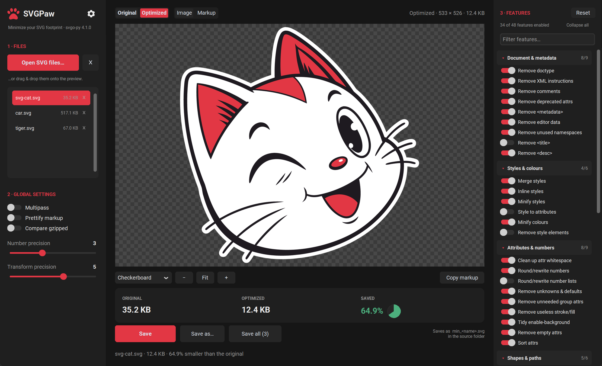
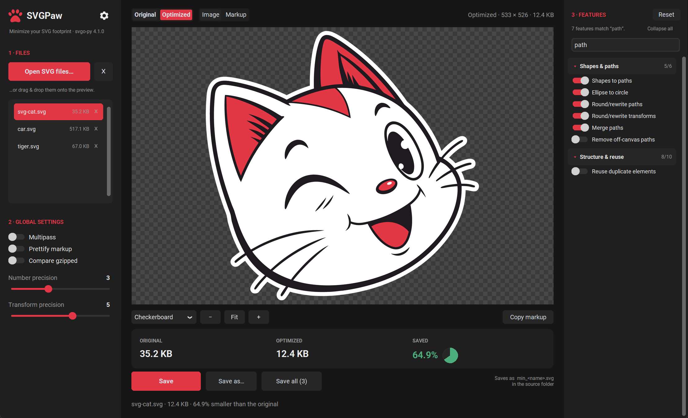
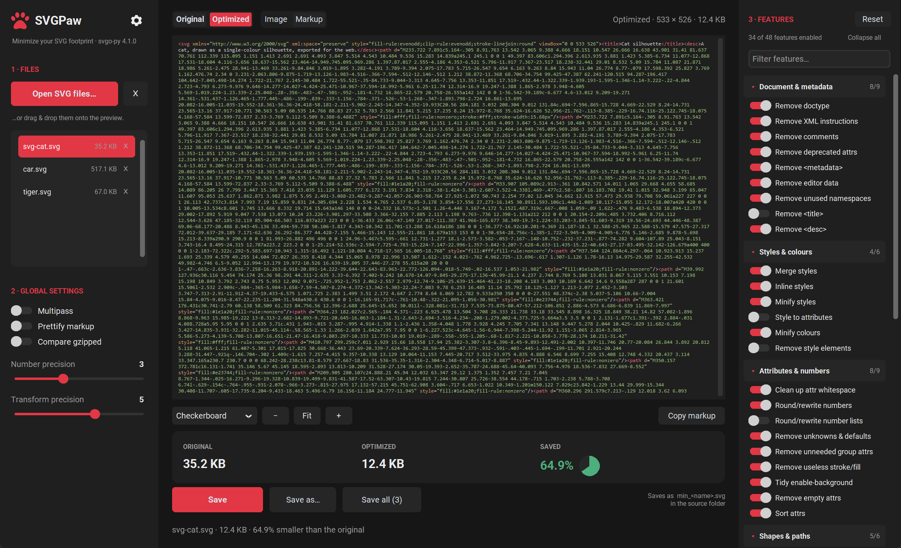
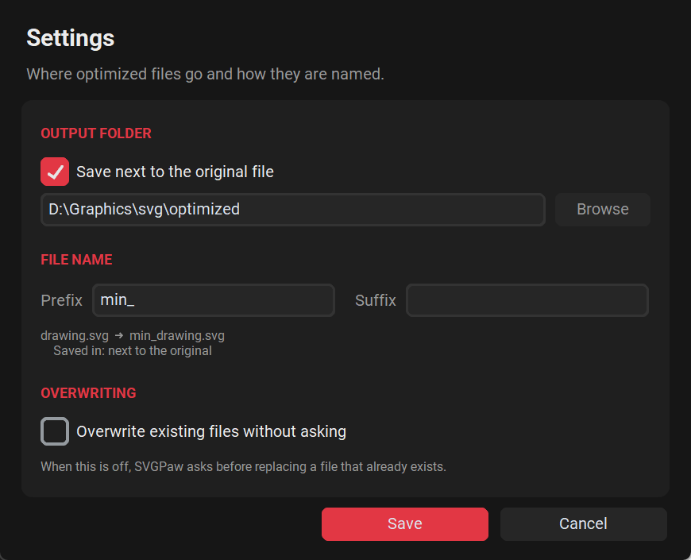

# 

> Minimize your SVG footprint

A desktop GUI for **[svgo-py](https://pypi.org/project/svgo-py/)** — the
pure-Python port of [SVGO](https://github.com/svg/svgo), the SVG optimizer.



Open (or drag & drop) SVG files, tune every SVGO plugin with a **live preview**,
flip between **Original** and **Optimized** to see exactly what the optimizer
did, and write the results back with a configurable file-name **prefix**.

It is the desktop equivalent of [SVGOMG](https://svgomg.net) — same settings,
same superpowers, same output — but it works on local files, in batches, and
without a browser or Node.js.

---

## Features

- **Open many SVGs at once** — via the file picker, by dropping them onto the
  window, by dropping a whole folder, or as command-line arguments. `.svgz`
  (gzipped SVG) is decompressed transparently.
- **Live optimization.** Every toggle and slider re-runs SVGO on the selected
  file (debounced) and refreshes the preview and the size read-out. The run
  happens in a worker process, so the window stays responsive throughout — a
  spinner in the corner of the preview says a new version is on its way, and
  changing anything while it turns cancels that run and starts the new one.
- **Original ⇄ Optimized** with one click — or the **Space** bar. Zoom and pan
  stay locked between the two views, so the comparison is pixel-for-pixel.
- **Image and Markup views.** The *Image* view rasterizes the SVG with wheel
  zoom, drag panning and a switchable backdrop (checkerboard, white, black,
  dark). The *Markup* view shows the actual output with syntax highlighting and
  a **Copy markup** button.
- **All 48 SVGO features** in their own column, grouped into seven collapsible
  categories (*Document & metadata*, *Styles & colours*, *Attributes & numbers*,
  *Shapes & paths*, *Structure & reuse*, *IDs & references*, *Strip content*).
  Each header shows how many of its features are on, there is a filter box that
  auto-expands the groups it finds something in, and every switch has a tooltip
  with its SVGO plugin name and what it does. Global options — *multipass*,
  *prettify*, *number precision*, *transform precision* — stay on the left.
- **Compare gzipped** — sizes are reported after gzip, which is what a web
  server actually transfers. The stat headings say `· GZIPPED` when they do, so
  they are never confused with the raw sizes in the file list and the toolbar.
  Turn it off for plain byte counts.
- **Batch saving.** *Save* writes the current file, *Save all* optimizes and
  writes every loaded file with the current settings and reports the total
  saving.
- **Configurable output** — a file-name **prefix** and suffix, an output folder
  (or "next to the original"), and an **overwrite without asking** switch.
- Settings, plugin selection and the output rules are remembered between runs.
- Dark theme with a red accent. The in-app icons are SVGs rendered by the app's
  own renderer, so they stay sharp at any scale and are recoloured from the
  palette rather than from a fixed bitmap.

---

## Install

### Windows

Run **`SVGPaw-<version>-Setup.exe`**. It installs per-user (no admin rights
needed) and bundles everything — no Python installation required. Building that
installer yourself is covered in
[Building the Windows app](#building-the-windows-app).

### From source

Any platform Tkinter runs on.

## Requirements

- Python **3.10+** (developed and tested on 3.13).
- No Node.js, no JavaScript runtime — `svgo-py` is pure Python.

## Installation

```bash
python -m venv .venv
# Windows
.venv\Scripts\activate
# macOS / Linux
source .venv/bin/activate

pip install -r requirements.txt
```

The preview is rendered with **resvg** (a browser-faithful renderer that handles
gradients, clip-paths and CSS-class styling correctly), with **PyMuPDF** as a
fallback. Both ship self-contained wheels, so no system libraries are needed. If
neither renderer is available the app still optimizes and saves — only the
on-screen image preview is skipped (the *Markup* view keeps working).

## Usage

```bash
python svgpaw.py
```

You can also pass files directly:

```bash
python svgpaw.py sample/svg-cat.svg sample/tiger.svg sample/car.svg
```

1. Click **Open SVG files…**, or drop files onto the preview area.
2. Pick a file in the list to work on it. The preview shows the optimized
   result right away.
3. Adjust **Global settings** on the left and **Features** on the right — the
   preview and the size read-out follow every change. Collapse the categories
   you do not need; the app remembers which ones you folded away.
4. Use **Original / Optimized** (or press **Space**) to check that nothing broke.
   Zoom in with the mouse wheel to inspect edges after lowering the precision.
5. Open **⚙ Settings** to choose the output folder, the file-name prefix, and
   whether existing files may be replaced silently.
6. **Save** writes the selected file; **Save all** does the whole list.

Filtering the feature list — only the groups with a hit stay on screen, and
they open themselves:



The **Markup** view shows what will actually be written:



### Keyboard shortcuts

| Shortcut | Action |
| --- | --- |
| `Ctrl+O` | Open files |
| `Ctrl+S` | Save the selected file |
| `Ctrl+Shift+S` | Save all loaded files |
| `Space` | Toggle Original / Optimized |
| Wheel | Zoom the image preview |
| Drag | Pan the image preview |
| Double-click | Fit the image to the window |

---

## Output files



The file name is built as

```
<prefix><original name><suffix>.svg
```

with `min_` as the default prefix and an empty suffix, so `logo.svg` becomes
`min_logo.svg`. The **⚙ Settings** dialog previews the result as you type.

The target folder is either the source file's own folder (the default) or one
fixed folder for everything.

> **Careful:** with an empty prefix *and* an empty suffix, the optimized file
> replaces the original. The settings dialog warns you when that combination is
> selected. SVGPaw asks before replacing any existing file unless
> *Overwrite existing files without asking* is enabled.

---

## Settings, defaults and SVGOMG parity

The plugin catalogue, the plugin order and the way settings are turned into an
SVGO invocation are a port of SVGOMG's
[`svgo-worker`](https://github.com/jakearchibald/svgomg) — including its quirk
of bumping `cleanupNumericValues` to a precision of 1 when the global number
precision is 0, because 0 almost always destroys the image there.

Two plugins were renamed in SVGO 4 and use the new names here (`cleanupIDs` →
`cleanupIds`, `removeScriptElement` → `removeScripts`), and the plugins SVGO 4
added (`removeDeprecatedAttrs`, `removeXlink`, `convertOneStopGradients`,
`prefixIds`) are part of the list.

**Which features start enabled** follows SVGO 4.1's own `preset-default` rather
than SVGOMG's older list. The practical differences: `removeViewBox` and
`removeTitle` are **off** by default (SVGO 4 dropped both from the preset —
removing the viewBox breaks responsive scaling, and `<title>` is the image's
accessible name), and `removeDeprecatedAttrs` is **on**. Every one of them is a
single switch away.

The seven categories in the features column are a **display grouping only**.
Plugins always run in SVGO's own order, which is the order of the catalogue in
[svgo_engine.py](svgo_engine.py) — regrouping the UI never changes the output.

Output was verified against the reference JavaScript SVGO: for
`sample/tiger.svg` with the default settings, SVGPaw and upstream SVGO 4.1
produce **byte-identical** files. On documents with `<style>` blocks small
differences can remain — `svgo-py` reimplements csso's value-level CSS
minification but not its structural passes; see the
[svgo-py README](https://pypi.org/project/svgo-py/) for details.

### Which size is shown where

Three places report a size, and they do not always agree:

| Where | What it is |
| --- | --- |
| File list | The raw size of the file on disk. Always raw. |
| Toolbar (top right) | The raw size of the document currently shown. |
| Stat tiles | Raw *or* gzipped, depending on **Compare gzipped**; the headings say `· GZIPPED` when they are gzipped. |

### A note on "Compare gzipped"

Optimizing can make the *gzipped* size grow even while the raw file shrinks: the
original's indentation and repeated formatting compress extremely well, and
minification removes exactly that redundancy. `sample/tiger.svg` is such a case
at the default precision. Toggle **Compare gzipped** off to see the raw bytes,
and lower the **number precision** (3 → 2 is usually invisible) when a file
refuses to shrink.

---

## Configuration

Settings are stored locally in:

```
~/.svgpaw/config.json
```

It holds the output rules, the window's view preferences, which feature
categories you collapsed, and your full SVGO plugin selection. Nothing is sent
anywhere — SVGPaw is entirely offline. Delete the file to return to the
defaults.

If you used this app under its old name, the settings from `~/.svgo_ui/config.json`
are picked up automatically the first time SVGPaw starts; the old file is left
where it is.

---

## Troubleshooting

| Symptom | Fix |
| --- | --- |
| Drag & drop does nothing | Ensure `tkinterdnd2` is installed in the active environment. |
| Window looks unstyled | Ensure `customtkinter` is installed in the active environment. |
| *"Preview could not be rendered"* | Reinstall the requirements (`resvg-py`). The optimization itself is unaffected — switch to the **Markup** view or save the file. |
| *"SVGO error: …"* | That plugin combination failed on this document. The original is kept; turn the last plugin you changed back off. |
| The optimized file is *larger* | Turn off **Compare gzipped** to see raw bytes, and check whether **Prettify markup** is on. |
| The image looks wrong after optimizing | Raise the **number precision**, or turn off `convertPathData` / `mergePaths` / `removeHiddenElems`. |
| A big file takes a few seconds to update | Optimizing and rasterizing a 500 KB SVG is genuinely a second or two of work. It happens in a worker process, so the window keeps responding; the spinner in the preview corner shows it is still running. |

---

## Building the Windows app

SVGPaw compiles to a native Windows program with
[Nuitka](https://nuitka.net), which translates the Python sources to C and hands
them to a real optimizing compiler. That is the reason to prefer it over a
bytecode bundler such as PyInstaller here: the bundler ships the same CPython
bytecode in a wrapper, while Nuitka removes the interpreter from the hot paths
and — with `--lto` — lets the compiler inline across module boundaries. The
optimizer is pure Python and CPU-bound, so that is exactly where the work is.

### What you need

- **Visual Studio 2022** with the *Desktop development with C++* workload.
  MSVC produces the faster binary and is the best-tested backend for Nuitka's
  LTO. Without it the build falls back to a Nuitka-managed MinGW64, which it
  downloads on first use.
- **[Inno Setup 6](https://jrsoftware.org/isinfo.php)** for the installer:

  ```bash
  winget install -e --id JRSoftware.InnoSetup
  ```

- The build dependencies:

  ```bash
  pip install -r requirements.txt -r requirements-build.txt
  ```

### Building

```bash
python build.py
```

That compiles the app to `dist\SVGPaw\` and, if Inno Setup is present, writes
`dist\SVGPaw-<version>-Setup.exe`. Expect roughly five minutes for the first
run; Nuitka caches the compiled C objects, so later runs take about half that.

| Flag | Effect |
| --- | --- |
| `--clean` | Delete `build/` and `dist/` first |
| `--no-installer` | Compile only |
| `--installer-only` | Rebuild just the installer from the existing `dist/` |
| `--onefile` | One portable `.exe` instead of a folder |
| `--jobs N` | Parallel compile jobs (default: every core) |

The default is a **standalone folder**, not `--onefile`. A onefile binary has to
unpack itself into a temp directory on every launch, which costs a second or two
of start-up; the installer puts the folder in place once, so that never happens.
Use `--onefile` when you want a single file to copy around on a USB stick.

**PyMuPDF is excluded from the build.** It is only the fallback renderer, resvg
is what actually runs, and including it would add about 100 MB of binaries for a
code path that is never reached. The import sits in a `try`/`except` and copes.
Running from source is unaffected.

The compiled program is self-contained — it carries its own Python, Tcl/Tk and
every dependency — so the target machine needs no Python installation.

### The installer

`installer\svgpaw.iss` builds a standard Inno Setup wizard. It installs
**per-user by default**, so there is no UAC prompt; the first page offers an
all-users install for anyone who wants one. It offers three optional choices:

- a **desktop shortcut**,
- **"Optimize with SVGPaw"** in the right-click menu for `.svg` and `.svgz`
  (on by default — it adds a verb without taking the file type over),
- making SVGPaw the **default handler** for `.svg` and `.svgz` (off by default).

SVGPaw always registers itself under *Open with*, whichever of those you pick.
Uninstalling removes everything it wrote, and asks separately whether to delete
`~/.svgpaw` — answering nothing (a silent uninstall) keeps your settings.

It supports the usual unattended switches:

```bash
SVGPaw-1.0.0-Setup.exe /VERYSILENT /SUPPRESSMSGBOXES /NORESTART /TASKS=contextmenu
```

---

## Project layout

```
SVGPaw/
├── svgpaw.py               # the application (UI, preview, file handling)
├── svgo_worker.py          # the child process: optimize + rasterize, no Tk
├── svgo_engine.py          # plugin catalogue + settings -> svgo-py invocation
├── build.py                # Nuitka compile + installer build
├── installer/
│   └── svgpaw.iss          # Inno Setup script
├── icon/
│   ├── svg.ico             # app, installer and shell icon
├── requirements.txt        # runtime dependencies
├── requirements-build.txt  # packaging dependencies
├── sample/                 # three test SVGs
└── docs/                   # screenshots
```

`build/` and `dist/` are produced by the build and are not in version control.
`info/` holds the upstream sources kept for reference (svgo-py, SVGOMG, and the
Recraft Vectorizer this UI's design is based on); nothing there is needed at
runtime.

## License

Provided as-is for personal use. SVGO and SVGOMG are MIT-licensed projects by
their respective authors; this is an unofficial, independent front-end.
